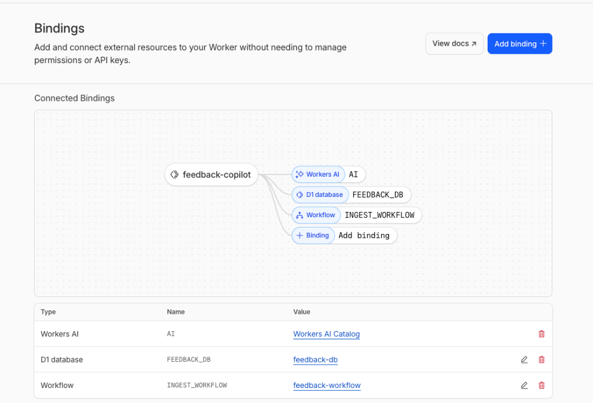

# Architecture Overview

This project implements a "Feedback Copilot" using a fully serverless, edge-native architecture on Cloudflare.

## Bindings at a Glance

| Binding | Type | Purpose |
|---------|------|---------|
| `AI` | Workers AI | LLM inference for analysis and chat |
| `FEEDBACK_DB` | D1 Database | Persistent storage for feedback data |
| `INGEST_WORKFLOW` | Workflow | Async processing pipeline |

## Core Components

### 1. Cloudflare Workers (Compute)
**Usage:** Hosts the main API endpoints (`/ingest`, `/chat`) and serves the server-side rendered UI.
**Why:**
- **Zero-cold-start** high performance for user-facing interactions.
- Unified platform to glue together storage, AI, and async tasks without managing infrastructure.
- Tight integration with Cloudflare Access for protecting internal dashboards.

### 2. Cloudflare D1 (Database)
**Usage:** Stores feedback entries, analysis results, and "gravity scores".
**Why:**
- **Relational Capabilities:** We need to sort by complex scores (`gravity_score`) and filter by JSON-derived fields (sentiment, category). A key-value store (KV) would be insufficient for these query patterns.
- **SQL Ecosystem:** Allows us to easily inspect data and run analytical queries using standard SQL.

### 3. Workers AI (Intelligence)
**Usage:** Runs `llama-3-8b-instruct` to categorize feedback (sentiment, bug vs. feature) and generate natural language summaries for the chat interface.
**Why:**
- **In-process Inference:** Avoids the latency and complexity of calling external APIs (like OpenAI).
- **Privacy:** Data remains within the Cloudflare network/region.
- **Cost-Effective:** Pay-per-neuron model fits the intermittent usage pattern of a feedback tool better than provisioned GPUs.

### 4. Cloudflare Workflows (Async Processing)
**Usage:** Decouples the user-facing ingest API from the heavy AI analysis.
**Why:**
- **Reliability:** If the AI model times out or hallucinate bad JSON, Workflows can automatically retry the step without failing the initial user request.
- **Latency:** The user gets an immediate "200 OK" on submission, while the expensive analysis happens asynchronously in the background.

## Data Flow

1.  **Ingest:** User submits feedback $\rightarrow$ `POST /ingest` $\rightarrow$ **Workflow** trigger.
2.  **Process:** Workflow Step 1 calls **Workers AI** to analyze sentiment/category $\rightarrow$ Step 2 calculates "Gravity Score" & saves to **D1**.
3.  **Chat/Query:** PM asks question $\rightarrow$ `POST /chat` $\rightarrow$ Worker converts intent to SQL $\rightarrow$ Queries **D1** $\rightarrow$ **Workers AI** generates summary from results.
